<p align="center">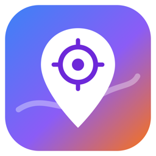</p>

# SV Map

SV Map is a macOS desktop app (Electron) that puts 133 big tech companies, tech companies, AI labs and AI startups from San Francisco to San Jose on an OpenStreetMap map. Every company shows up as its logo at its real address. You can type a company, city or street to find it, or pan and zoom around the valley and click a logo to see the address.

## How it works

1. `data/companies.json` holds every company: name, category, street address, city, domain and coordinates.
2. `tools/geocode.mjs` geocoded each street address once with OpenStreetMap Nominatim. It rejects any hit more than 2.5 km from the expected spot, so a wrong match can't move a pin across the valley.
3. `tools/fetch-logos.mjs` downloaded one logo per company into `data/logos/`. It prefers square icons: apple-touch-icon, the homepage's declared icons, the Wikidata logo when the official site matches, and Google and DuckDuckGo favicons. When all of those are low resolution, it renders the brand's Simple Icons mark in the official brand color, but only if the Simple Icons entry points at the company's own domain. Every file is then normalized to a real PNG of at most 256px.
4. `server/server.mjs` is a zero-dependency Node server. It serves the UI, Leaflet, the logos and a small JSON API.
5. The UI draws OpenStreetMap tiles with Leaflet and plots a round logo pin for every company at every zoom level. Logos that would overlap are pushed apart, and a thin line in the category color leads back to a dot at the real address.
6. The Electron shell shows a boot screen, runs `scripts/start-all.sh`, checks each service, loads the UI, and runs `scripts/stop-all.sh` on quit.

## Architecture

<p align="center">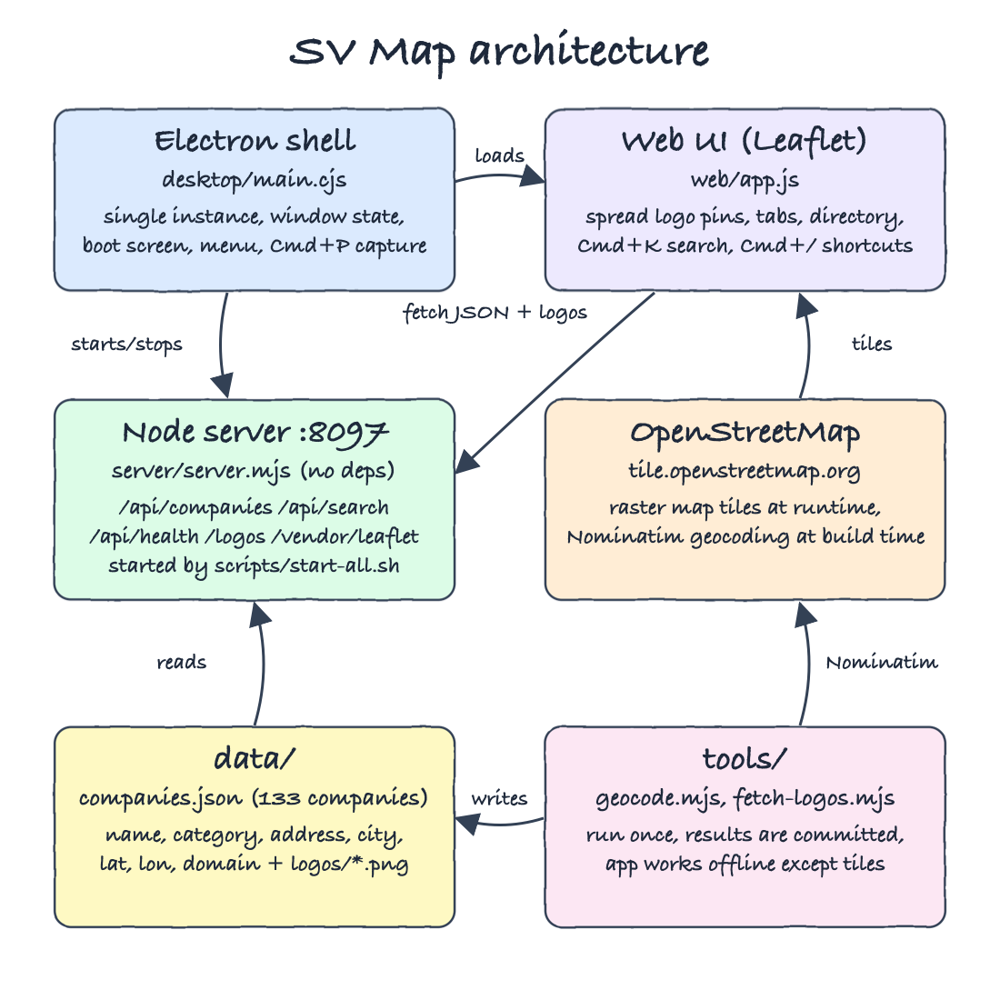</p>

## Features

* **Logo pins at real addresses**: you can recognize a company without reading a label.
* **Every logo always visible**: no count bubbles hiding companies. Crowded logos (SoMa, Santa Clara) spread apart without overlapping, with a leader line to the true address.
* **Type to find**: the sidebar and the ⌘K palette match name, city, street or domain, and rank exact and prefix matches first.
* **Click for the address**: the popup shows the street, city, category, website and an "Open in OpenStreetMap" link.
* **Category tabs**: All, Big Tech, Tech, AI Labs, AI Startups (⌘1..⌘5) filter both the map and the list.
* **Directory tab** (⌘6): every company as a card grid grouped by category, for browsing without the map.
* **Boot screen**: shows Node.js, the server/API, company data, logos and tile reachability before the map opens.
* **Desktop behaviors**: single instance, remembered position/size/full screen, double-click title to maximize/restore, ⌘+/⌘-/⌘0 zoom, ⌘⇧↵ full screen, ⌘P saves a window screenshot to the Desktop, and ⌘C/⌘X/⌘V work.
* **Shortcuts panel** (⌘/): groups shortcuts by color with inline SVG icons, filters as you type, and Esc clears the search, then closes the panel.

## Stack

* **Electron**: a native macOS window with menus, single-instance lock and window capture.
* **Leaflet 1.9**: the only runtime library; a small, proven renderer for OSM raster tiles.
* **OpenStreetMap tiles and Nominatim**: free map data and geocoding, no API key.
* **Node.js `http`**: the server needs no framework to serve static files and three JSON routes.
* **Vanilla ES modules**: search, logo spreading and modals are small, pure functions shared by the UI and the tests.
* **`node --test`**: the built-in test runner, no test framework dependency.
* **Bash scripts**: setup, start, stop, status, test, install and uninstall.

## API

| Method | Path | Returns |
|---|---|---|
| GET | `/api/health` | `{"status":"ok","companies":133}` |
| GET | `/api/companies` | every company, plus `logo: true/false` |
| GET | `/api/companies/:id` | one company, or 404 |
| GET | `/api/search?q=<text>&category=<all\|bigtech\|tech\|ailab\|aistartup>` | ranked matches |
| GET | `/logos/:id.png` | company logo |

Company record:

```json
{"id":"openai","name":"OpenAI","category":"ailab","domain":"openai.com","address":"1455 3rd Street","city":"San Francisco","lat":37.7686,"lon":-122.3892,"logo":true}
```

## Design decisions

* **Data is committed, not fetched at startup.** Geocoding and logo scraping are slow and rate-limited. They ran once, and the app only needs the network for map tiles.
* **Spread logos instead of clustering them.** Count bubbles hid most logos at valley zoom. `web/spread.js` pushes overlapping pins apart pairwise until none overlap (about 15ms for 133 pins), and leader lines keep the real address readable. It is about 25 lines, so no plugin is needed.
* **Square logos beat wordmarks.** A wide wordmark shrinks to a sliver inside a round pin, so the logo picker scores square icons above wide ones. Brands whose only official mark is a wordmark (AMD, Cisco, eBay, Intel) still look small.
* **Logos are real PNGs.** The server labels every logo `image/png`. Favicons often arrive as `.ico`, which Chromium tolerates but stricter renderers drop, so every file is converted with `sips`.
* **The API reports `logo: false`** for a company with no public logo (Safe Superintelligence), so the UI draws initials instead of requesting a missing file.
* **Every port lives in `scripts/ports.env`.** The Electron shell reads the port from there too.

## Data notes

Addresses are public office addresses as of September 2026, checked against company sites, SEC filings and office-lease news. Some startups only list a business-directory address, and a few (ElevenLabs, Runway) have no public SF street address, so their pin marks the city. Offices move, so verify an address before relying on it.

## Run

```bash
./scripts/setup.sh
./scripts/start-all.sh
./scripts/ui.sh
./scripts/test-all.sh
./scripts/stop-all.sh
```

Desktop app:

```bash
./scripts/install.sh
open -a "SV Map"
./scripts/uninstall.sh
```

`install.sh` always runs `uninstall.sh` first, so only one copy of the app is ever installed. For development, `npm run app` runs Electron from the source tree.

Refresh the data:

```bash
node tools/geocode.mjs
node tools/fetch-logos.mjs --upgrade
tools/make-icon.sh
```

## Tests

`./scripts/test-all.sh` runs 27 tests in 6 files:

* `data.test.mjs`: every pin sits inside the SF to San Jose corridor, ids are unique, each category is populated, every company has a logo (only an explicit no-public-logo list may fall back to initials), and every logo file is a real PNG.
* `search.test.mjs`: ranking, loose typing, city/street search, category filter.
* `spread.test.mjs`: 60 stacked logos end with no overlap, companies at identical addresses separate, non-overlapping logos stay on their address.
* `help.test.mjs`: shortcut filtering rules and the required shortcuts are all listed.
* `server.test.mjs`: health, search, category filter, logo flag, 404s and path traversal blocked.
* `dataset.test.mjs`: the geocoder's distance guard.

## Printscreens

**Boot screen.** Electron checks Node.js, starts the server with `scripts/start-all.sh`, confirms the data and logos, and pings the OSM tile server before it opens the map.

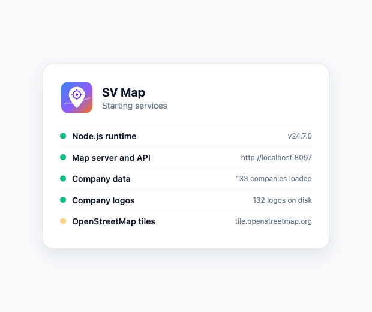

**The whole valley.** All 133 companies from San Francisco to San Jose, each as its logo. The San Francisco group fans out around the city and the Santa Clara group around its campuses.

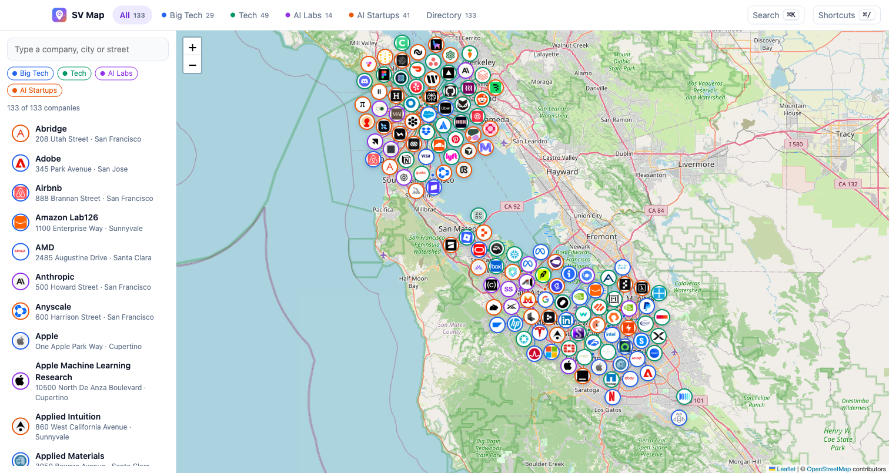

**San Francisco.** City zoom with OpenAI selected. Every SoMa, Mission Bay and Financial District company shows its logo, and the thin lines lead to each real address.

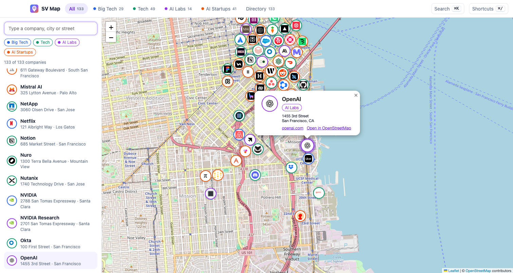

**⌘K search.** Typing "ai" lists every match with its category and city. Arrow keys and Enter fly the map to the company.

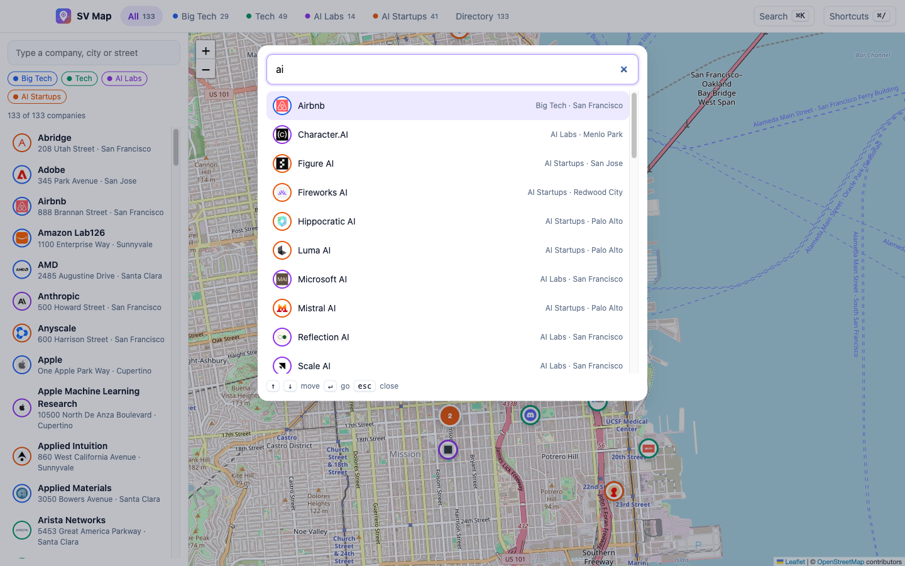

**Company address.** Typing "nvidia" in the sidebar and pressing Enter flies to the pin and opens the popup with the address, website and an OpenStreetMap link. The pin sits on NVIDIA's Voyager building.

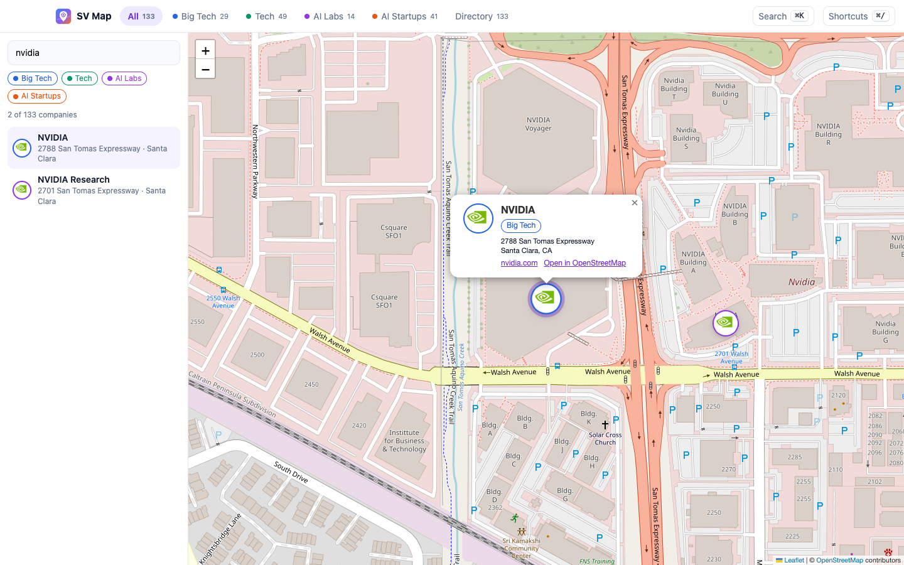

**AI Labs tab.** ⌘4 filters the map and the list to AI labs only. Safe Superintelligence shows its initials because it publishes no logo.

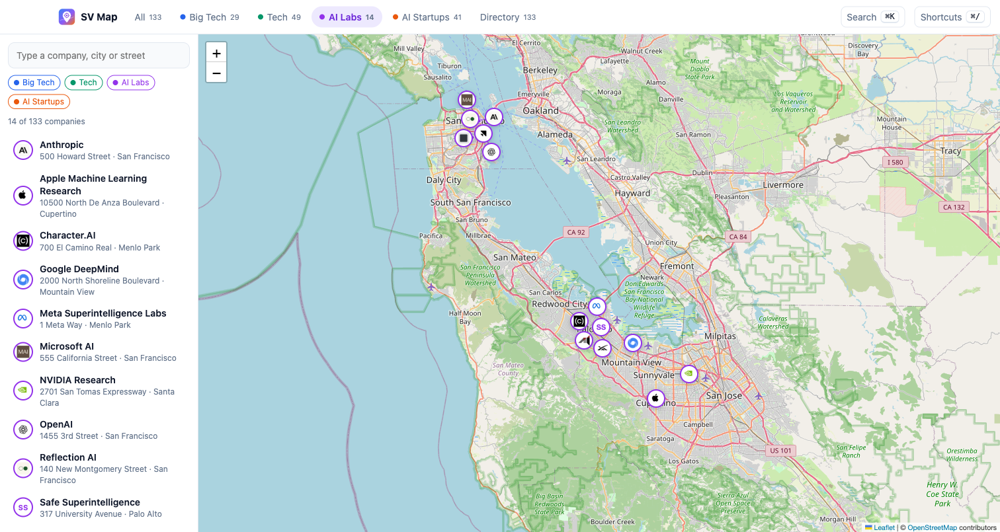

**Directory tab.** ⌘6 shows every company as a card with its address, grouped by category. Clicking a card jumps back to the map.

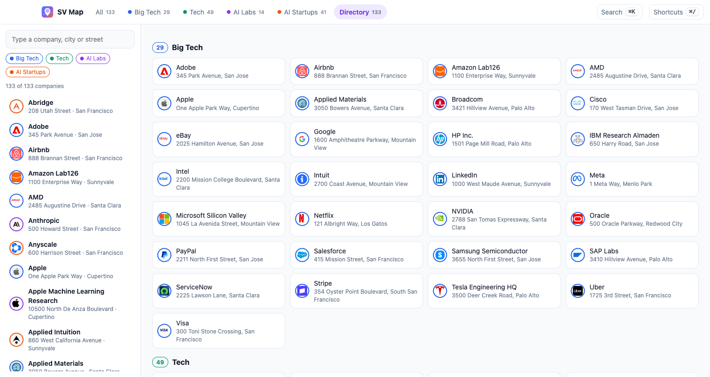

**Shortcuts panel.** ⌘/ opens the shortcuts grouped by feature, each group with its own color and icon, with a filter box on top.

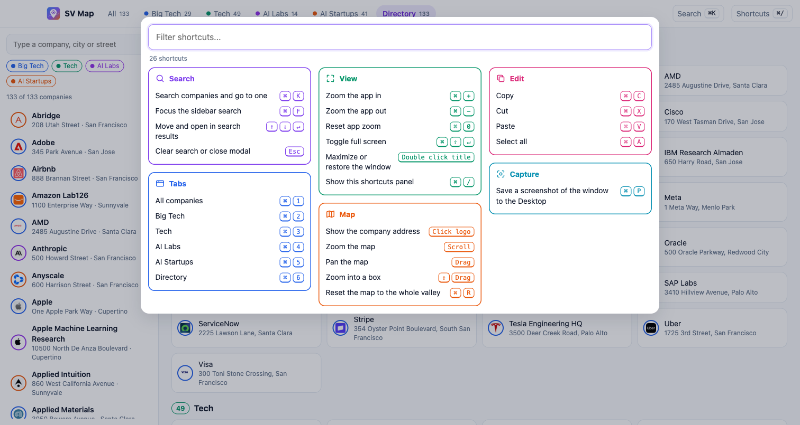

**Desktop app.** The installed macOS app window, captured with its own ⌘P screenshot shortcut.

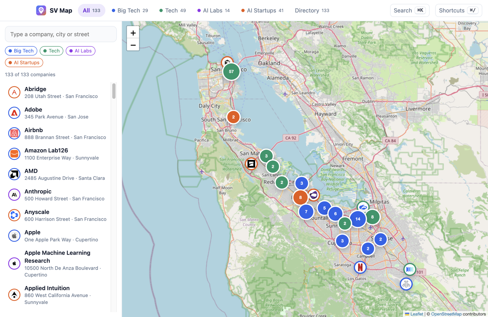

## Scripts

All scripts live in `scripts/` and run from any directory of the repository.

| Script | What it does |
|---|---|
| `./scripts/setup.sh` | Installs dependencies, the Electron binary and any missing logos |
| `./scripts/start-all.sh` | Starts every service and prints the full link of each one |
| `./scripts/status.sh` | Shows every service port as UP or DOWN |
| `./scripts/test-all.sh` | Runs every test suite |
| `./scripts/ui.sh` | Opens the UI in the browser |
| `./scripts/stop-all.sh` | Stops every service |
| `./scripts/install.sh` | Uninstalls any previous copy, then installs `SV Map.app` |
| `./scripts/uninstall.sh` | Quits the app, stops services and removes `SV Map.app` |

Ports are declared in `scripts/ports.env` (`WEB=8097`, served at `http://localhost:8097`).

```bash
./scripts/setup.sh
./scripts/start-all.sh
./scripts/status.sh
./scripts/ui.sh
./scripts/stop-all.sh
```
