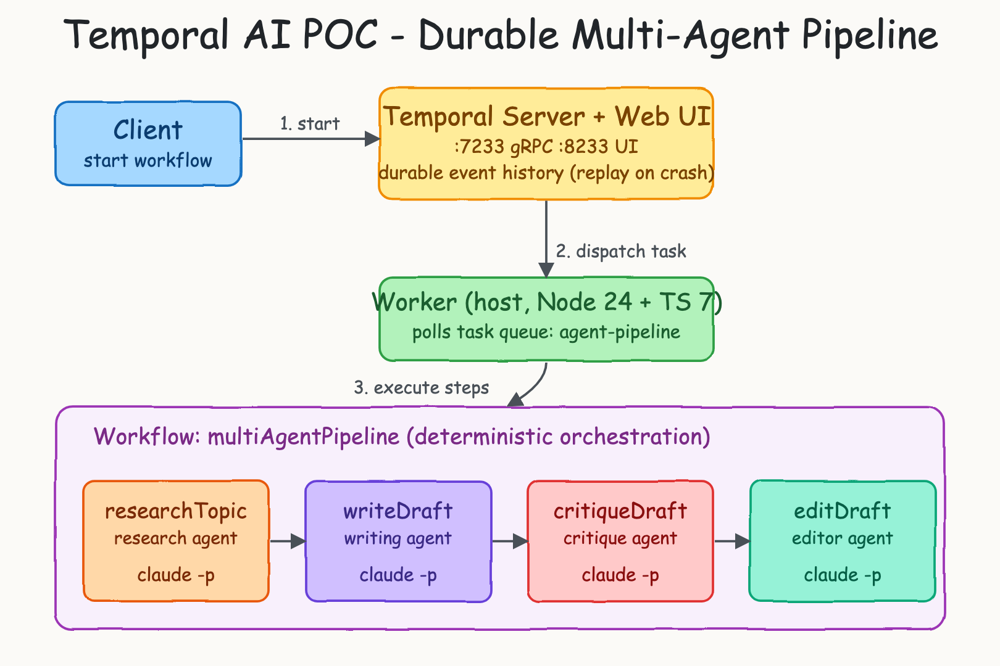
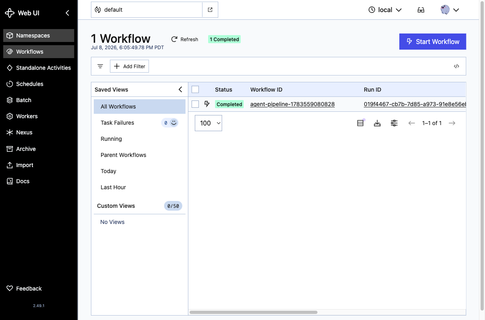
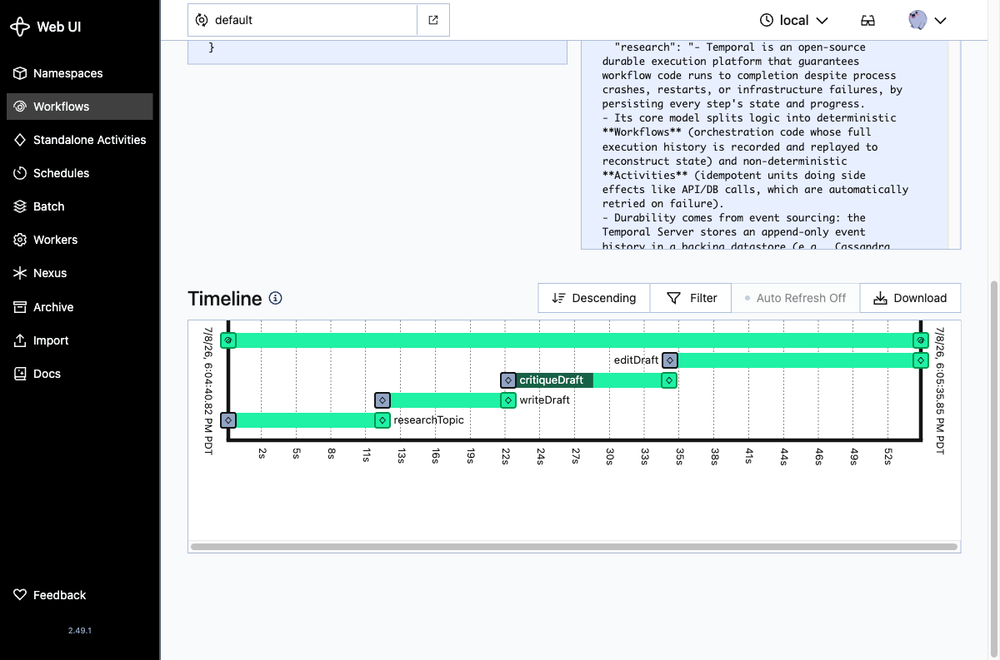

# Temporal AI POC — Durable Multi-Agent Pipeline

A tiny proof of concept that runs a **durable, multi-agent AI pipeline** on
[Temporal](https://github.com/temporalio/sdk-typescript). Four AI agents
(researcher, writer, critic, editor) collaborate to turn a topic into a polished
article. Each agent is a `claude -p` call, and Temporal makes the whole chain
**crash-proof**: if the worker dies mid-pipeline, Temporal replays the recorded
history and resumes exactly where it left off — no work is repeated, no state is
lost.

Everything is TypeScript, run directly by Node 24 (native type-stripping, no
build step) and type-checked with **TypeScript 7**.

## Architecture



| Piece | What it is | Why durable execution matters |
|-------|------------|-------------------------------|
| **Client** (`src/client.ts`) | Starts the workflow and waits for the result. | Fire-and-forget; the pipeline keeps running server-side even if the client disconnects. |
| **Temporal Server + Web UI** | `temporalio/temporal server start-dev` in a container. gRPC on `:7233`, UI on `:8233`. | Persists an append-only **event history** for every workflow. This is the source of truth that survives crashes. |
| **Worker** (`src/worker.ts`) | Node process on the host that polls the `agent-pipeline` task queue and runs the code. | Runs on the host so it can shell out to the `claude` CLI. Can be killed and restarted at any time. |
| **Workflow** (`src/workflows.ts`) | `multiAgentPipeline` — deterministic orchestration of the four agents. | Deterministic code that Temporal can replay. It only decides the *order*; it never does I/O directly. |
| **Activities** (`src/activities.ts`) | The four agents. Each runs `claude -p` with a role-specific prompt. | Non-deterministic side effects live here. Automatically retried on failure (up to 3 attempts). |

### The agent pipeline

```
researchTopic  ->  writeDraft  ->  critiqueDraft  ->  editDraft
 research agent    writing agent    critique agent    editor agent
```

1. **researchTopic** — produces 5 factual bullet points about the topic.
2. **writeDraft** — writes a ~150-word article from that research.
3. **critiqueDraft** — returns 3 concrete, actionable improvements.
4. **editDraft** — rewrites the draft applying every suggestion → final article.

The workflow simply `await`s them in sequence and returns every intermediate
output, so you can see how the agents built on each other.

## Requirements

- [podman](https://podman.io/) + `podman-compose` (the container ships both the Temporal server and the Web UI)
- **Node 24+** (runs `.ts` files directly — no transpile step)
- The `claude` CLI, installed and authenticated (the agents call `claude -p`)

## Run it

```bash
./start.sh    # starts Temporal (server + UI) and the worker
./test.sh     # runs one pipeline and prints every agent's output
./stop.sh     # stops the worker and the Temporal container
```

`start.sh` brings up the container, waits for ports `7233` and `8233`, installs
npm dependencies on first run, then launches the worker in the background
(`worker.log` holds its logs). Give a custom topic to `test.sh`:

```bash
./test.sh "Why event sourcing scales"
```

Then open the Web UI to watch it live: **http://localhost:8233**

## Watching durability in the Web UI

The workflow list shows the completed run:



Open the run to see the timeline — each of the four agents appears as its own
activity on the durable event history:



### Prove the durability yourself

While a pipeline is running, kill the worker:

```bash
kill "$(cat worker.pid)"
```

The Temporal server keeps the workflow alive. Restart the worker:

```bash
node src/worker.ts
```

It reconnects, Temporal replays the history, and the pipeline continues from the
next unfinished agent — already-completed agents are **not** run again.

## Project layout

```
src/
  shared.ts       shared types and the task-queue name
  activities.ts   the four claude -p agents (side effects, retried)
  workflows.ts    multiAgentPipeline — deterministic orchestration
  worker.ts       connects to Temporal, runs workflows + activities
  client.ts       starts a workflow and prints the result
podman-compose.yml  single-container Temporal dev server + Web UI
start.sh / stop.sh / test.sh
```

## Notes

- **No build step.** Node 24 strips the TypeScript types at run time. `npm run typecheck` runs `tsc --noEmit` on **TypeScript 7** for full type safety.
- **Minimal dependencies.** Only the four `@temporalio/*` SDK packages at runtime; `typescript` and `@types/node` for checking.
- Per the repo convention, the code carries no comments — all documentation lives here in this README.
