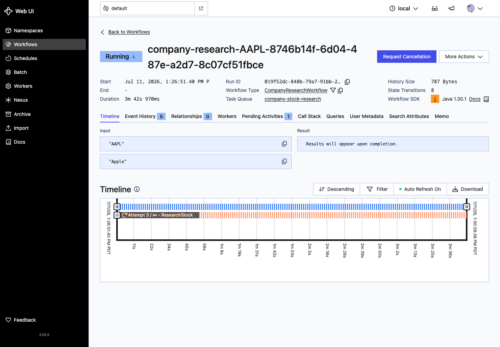

# temporal-java-25-poc

Java 25, Maven, Spring Boot 4.1.0, Spring AI 2.x, Temporal, PostgreSQL, HikariCP, Spring Data JDBC, and Swagger.

The service runs a Temporal workflow with three agents:

1. Stock agent researches current stock signals through `codex exec`.
2. News agent researches latest company news through `codex exec`.
3. Decision agent judges `BUY` or `HOLD` through `codex exec`.

## Run

```bash
./start.sh
```

## Stop

```bash
./stop.sh
```

## Test

```bash
./test.sh
```

## Logs

The app uses Log4j2 through `src/main/resources/log4j2-spring.xml`.

Logs go to the console and to `logs/temporal-java-25-poc.log`.

Use this to increase app logging:

```bash
APP_LOG_LEVEL=DEBUG ./start.sh
```

The workflow logs show workflow ID, run ID, task queue, activity names, activity attempts, Codex CLI timing, output length, decisions, and report persistence.

## Temporal UI

```bash
./temporal-ui.sh
```

Open `http://localhost:8081`.

Workflow timeline:

`http://localhost:8081/namespaces/default/workflows/company-research-AAPL-8746b14f-6d04-487e-a2d7-8c07cf51fbce/019f52dc-848b-79a7-91bb-24aa84cb3266/timeline`



## Swagger

Open `http://localhost:8082/swagger-ui` or `http://localhost:8082/swagger`.

## API

```bash
curl -s -X POST http://localhost:8082/api/research \
  -H 'Content-Type: application/json' \
  -d '{"symbol":"AAPL","company":"Apple"}'
```

```bash
curl -s 'http://localhost:8082/api/research?page=0&size=10'
```

## Trigger Temporal From REST

```bash
./trigger-temporal-rest.sh
```

```bash
./trigger-temporal-rest.sh MSFT Microsoft
```

The script calls Spring Boot at `POST http://localhost:8082/api/research/trigger`. That endpoint starts a Temporal workflow and returns immediately with the workflow ID, run ID, and Temporal UI URL.

`POST http://localhost:8082/api/research` still runs the blocking path. It waits for the workflow result and saves the report in PostgreSQL.

## Temporal Session

Temporal is the durable orchestration layer in this app. Spring Boot receives HTTP traffic, but Temporal owns the long-running stock research process. If the JVM, worker, network, or an agent call fails, Temporal keeps workflow history and can retry work from the last recorded event.

The request flow is:

1. `trigger-temporal-rest.sh` sends a stock symbol and company name to `ResearchController`.
2. `ResearchService` creates a `CompanyResearchWorkflow` stub using the Temporal Java SDK.
3. Temporal schedules the workflow on the `company-stock-research` task queue.
4. The Spring Boot worker registered in `TemporalConfig` polls that task queue.
5. `CompanyResearchWorkflowImpl` runs the agent pipeline.
6. `StockAgentActivityImpl` calls `CodexCliService` for stock research.
7. `NewsAgentActivityImpl` calls `CodexCliService` for latest news research.
8. `DecisionAgentActivityImpl` calls `CodexCliService` to choose `BUY` or `HOLD`.
9. `ResearchService` saves the final `ResearchReport` through Spring Data JDBC.
10. `GET /api/research?page=0&size=10` reads saved reports with repository pagination.

Temporal separates workflow code from activity code. The workflow is the durable plan. Activities are the side-effecting agent calls. This matters because `codex exec` can be slow or fail. Temporal records each activity attempt, timeout, retry, and final result in the workflow timeline. Each activity is capped at 3 attempts.

In this app, Spring AI is used to structure the prompt before the CLI call. `CodexCliService` builds a Spring AI `Prompt` with a `UserMessage`, extracts the content, and passes it to `codex exec`. The actual model call is still made by the Codex CLI, while Spring AI gives the prompt path a standard Java abstraction.

The Temporal UI screenshot above shows a workflow named `company-research-AAPL-8746b14f-6d04-487e-a2d7-8c07cf51fbce`. The timeline view shows workflow input, workflow type, task queue, event history, and the current activity. In the captured run, `ResearchStock` is visible in the timeline. If the page shows `activity StartToClose timeout`, the activity exceeded its configured runtime budget before the agent call returned. The app now gives the CLI up to 5 minutes and the Temporal activity up to 6 minutes, so slow agent calls should return a controlled result before Temporal closes the activity attempt.
