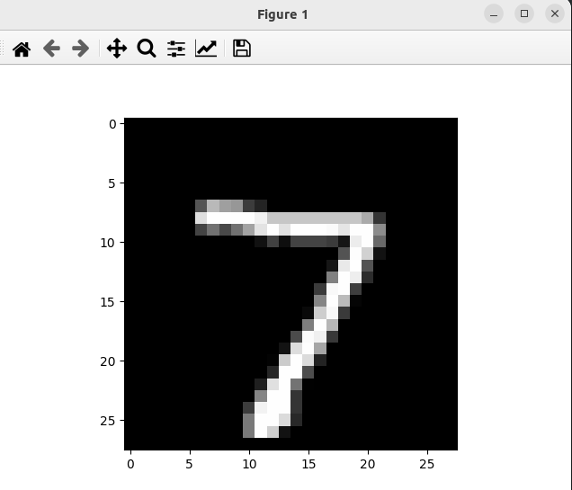

### Result
* The dataset is mnist dataset.
* The code is predicting the digit in the image.
* Prediction result is 7.
```
Epoch 1/5
1875/1875 ━━━━━━━━━━━━━━━━━━━━ 4s 2ms/step - accuracy: 0.8621 - loss: 0.4804
Epoch 2/5
1875/1875 ━━━━━━━━━━━━━━━━━━━━ 3s 2ms/step - accuracy: 0.9554 - loss: 0.1518
Epoch 3/5
1875/1875 ━━━━━━━━━━━━━━━━━━━━ 3s 2ms/step - accuracy: 0.9663 - loss: 0.1093
Epoch 4/5
1875/1875 ━━━━━━━━━━━━━━━━━━━━ 5s 2ms/step - accuracy: 0.9715 - loss: 0.0891
Epoch 5/5
1875/1875 ━━━━━━━━━━━━━━━━━━━━ 6s 3ms/step - accuracy: 0.9771 - loss: 0.0722
313/313 ━━━━━━━━━━━━━━━━━━━━ 0s 1ms/step - accuracy: 0.9710 - loss: 0.0892
Model saved
[7]
1/1 ━━━━━━━━━━━━━━━━━━━━ 0s 45ms/step
[[4.2240336e-07 4.6860920e-09 6.2838422e-05 5.6604305e-05 4.6151784e-11
  2.9989329e-07 5.5532998e-14 9.9986088e-01 5.1909450e-07 1.8307092e-05]]
7
```



