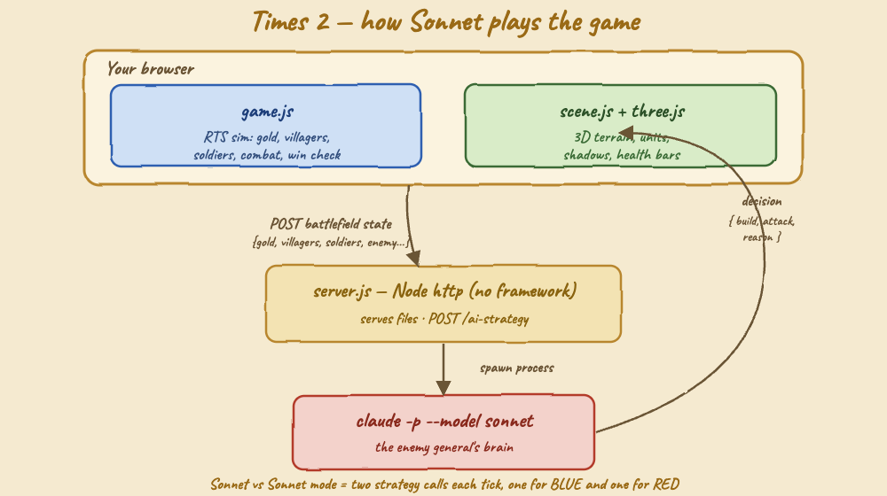
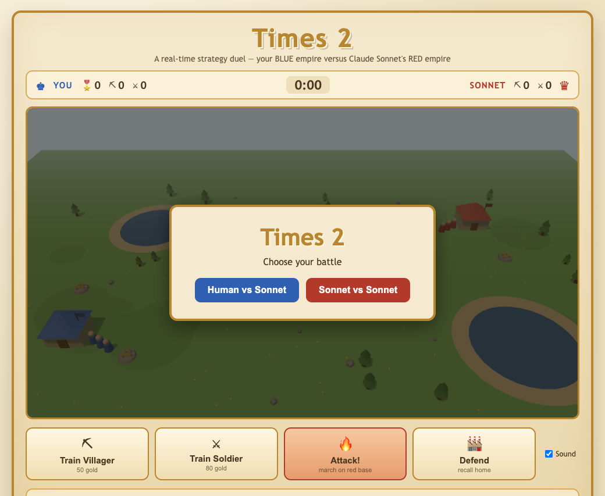
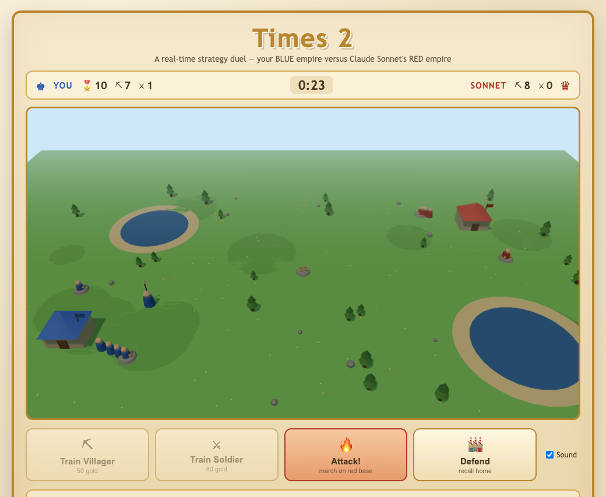
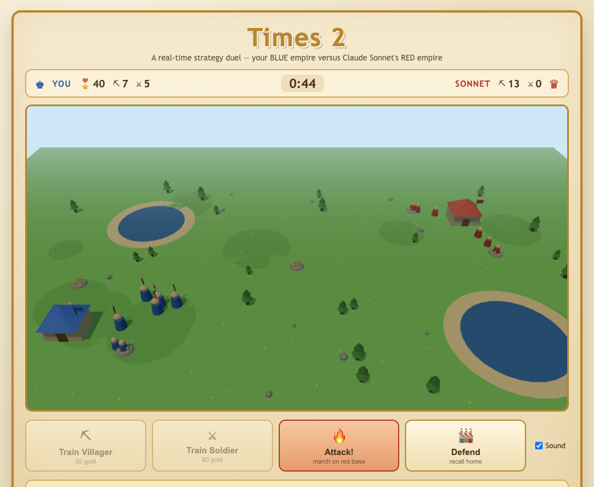
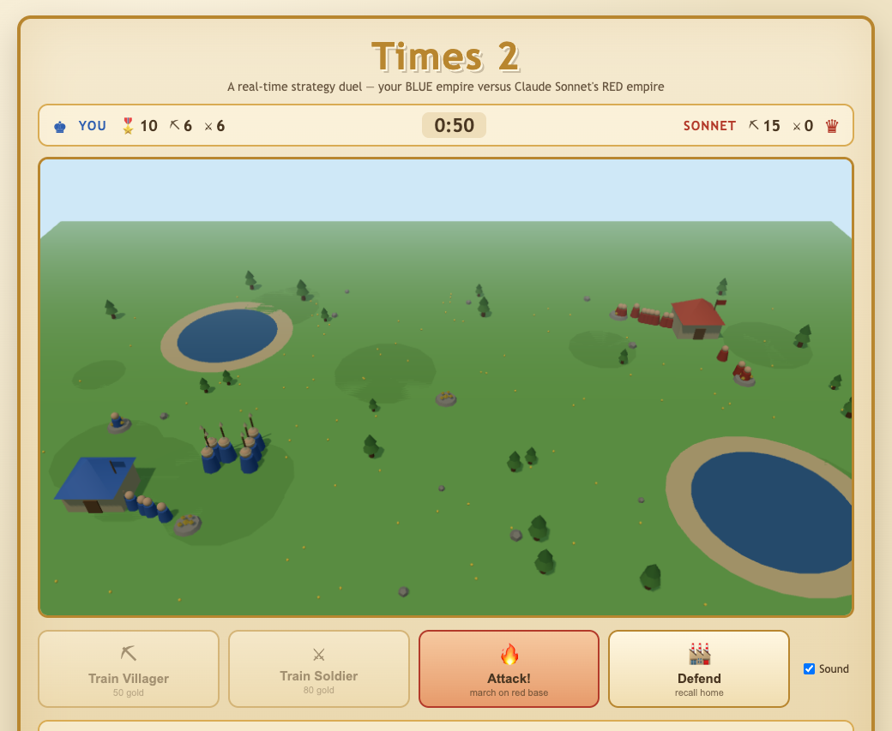
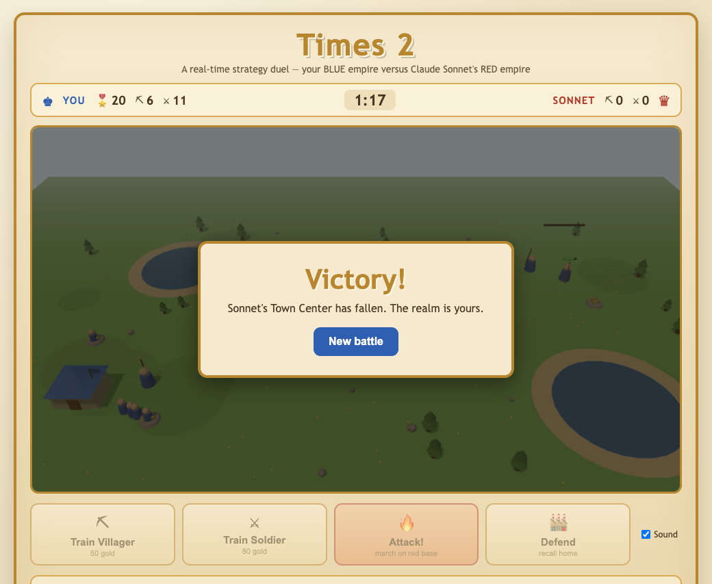
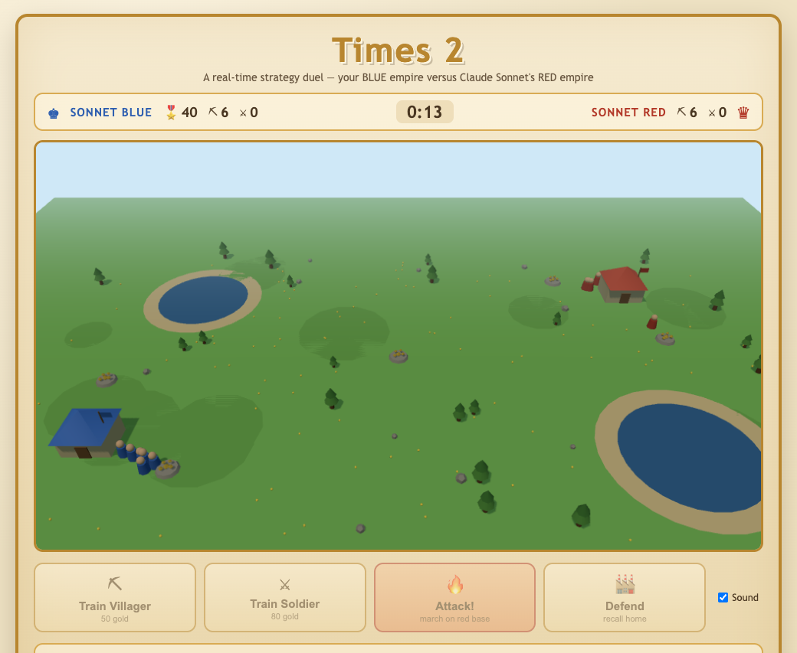

# Times 2

A browser real-time strategy game in the spirit of Age of Empires II, where you command the **BLUE** empire against an enemy **RED** empire whose strategy is decided live by **Claude Sonnet** through `claude -p`.

Gather gold, train villagers and soldiers, and raze the enemy Town Center before yours falls.

## The brief

> i want a web game RPS (real-time strategy) like Age of Empires 2, called "times 2" — must use AI to play against a human, the AI must be Sonnet and use `claude -p`, the game must be web with a light theme, with sounds, a start/stop script and a README. It must also offer **Human vs AI** and **AI vs AI**, and look 3D / real.

## How Sonnet plays

The simulation (economy, unit movement, combat, win condition) runs in the browser. Every 6 seconds each AI empire sends its battlefield state to the Node server, which spawns `claude -p --model sonnet` and asks for a decision. Sonnet replies with compact JSON and the army obeys it:

```json
{ "build": "soldier", "attack": true, "reason": "8v5 soldier edge, enemy base weaker, push now" }
```

`build` chooses the next unit to train, `attack` decides whether the army marches on the enemy base. Every decision and its reason is printed live in the **Sonnet's war council** panel. In **Sonnet vs Sonnet** mode the server is queried twice per tick — once for BLUE, once for RED — so two Sonnets fight each other.



## Game design

- **Gold** is the only resource. Villagers walk to gold crystals, mine them, and carry gold back to the Town Center.
- **Villager** — 50 gold. Gathers gold; grows your economy.
- **Soldier** — 80 gold. Spear unit; fights enemy units and buildings.
- **Town Center** — spawns your units and is the target. When its health reaches zero, that empire loses.
- Soldiers auto-engage nearby enemies. On **Attack** they march on the enemy Town Center; on **Defend** they hold near home; clicking the field sends them to rally at that spot.

The name **Times 2** is the duel itself: two empires, and in AI-vs-AI two Sonnets — doubled.

## Modes

- **Human vs Sonnet** — you run BLUE by hand; Sonnet runs RED.
- **Sonnet vs Sonnet** — both empires are driven by independent Sonnet calls; the command bar is disabled and you watch the two war councils unfold.

## Controls

- **Train Villager / Train Soldier** — queue a unit at your Town Center (costs gold).
- **Attack!** — send every soldier to march on the red base.
- **Defend** — recall soldiers to hold the home base.
- **Click the battlefield** — rally your soldiers to that point.
- **Sound** — toggle audio.

## Sounds

All audio is synthesized in the browser with the Web Audio API (no audio files): coin chimes when villagers deposit gold, a clack when training completes, clashes on hits, and victory / defeat fanfares.

## Run it

Requirements:
- Node.js (uses only the standard library).
- The `claude` CLI installed and logged in (the server shells out to `claude -p --model sonnet`). If Sonnet is unreachable, the enemy falls back to a built-in heuristic and the war council marks the entry `[fallback]`.

```bash
./start.sh      # starts the server on http://localhost:4321
./stop.sh       # stops it
```

Then open http://localhost:4321 and choose a battle.

## Screenshots

**Choose your battle** — the mode select over the live 3D battlefield (grass, ponds with sandy shores, both Town Centers).



**Economy** — your blue villagers gathering gold around the Town Center while Sonnet booms its own economy across the map.



**Mustering an army** — spear soldiers gather at the blue base; the HUD tracks both empires' villager and soldier counts.



**The assault** — soldiers marching on the red base after the **Attack!** order.



**Victory** — Sonnet's Town Center has fallen. Health bars, shadows and the 3D units are all rendered with Three.js.



**Sonnet vs Sonnet** — both empires are AI-controlled (note the greyed command bar and the two-sided war council).



## Project layout

```
times-2-game/
  server.js            Node http server + claude -p strategy endpoint
  public/
    index.html         light-theme parchment UI
    style.css
    game.js            RTS simulation + game loop (ES module)
    scene.js           Three.js 3D rendering of the simulation
    sounds.js          Web Audio sound effects
    vendor/
      three.module.js  Three.js (vendored, the only dependency)
  start.sh  stop.sh
  printscreens/
```

## Notes

- Light parchment theme throughout; the 3D field uses a sky-blue background, green terrain, water and warm sunlight with shadows.
- The only third-party dependency is Three.js, vendored under `public/vendor/` so the game is fully self-contained and works offline.
