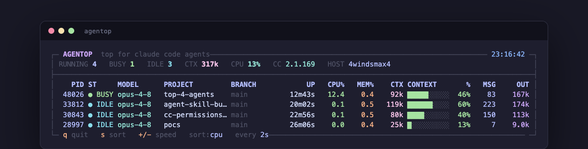
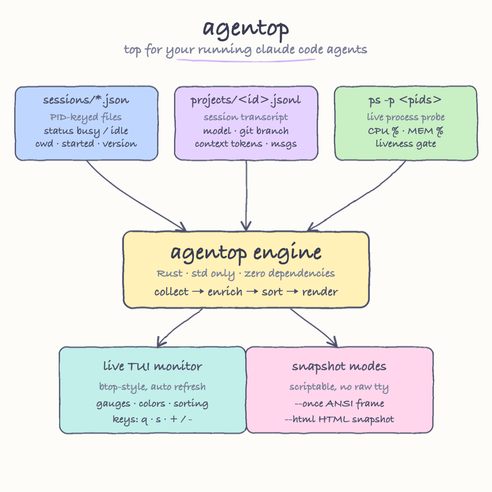

# agentop

`top` / `btop`, but for your running **Claude Code agents**.

A live terminal monitor that shows every Claude Code session currently running on
your machine: which are busy, which are idle, the model in use, the project, the
git branch, real CPU/memory of each agent process, how much of the context window
is filled, and how much work each one has produced.

Written in Rust with **zero dependencies** (pure `std` + ANSI + `stty`).



The screenshot above is a real capture: four Claude Code agents running at once. The
top one is `BUSY` (working), the rest are `IDLE` (waiting on input). Each row shows
the agent's PID, live CPU%/MEM% from `ps`, the context window gauge, message count,
and total output tokens generated.

## What it reads

`agentop` does not call any API and does not attach to the agents. It reads the
files Claude Code already writes to `~/.claude` and probes the OS for liveness.



As the diagram shows, three sources are merged per agent:

- **`~/.claude/sessions/<pid>.json`** — one file per running session, named by OS
  process id. Gives the live `status` (`busy` / `idle`), `cwd`, `sessionId`,
  `startedAt`, and Claude Code `version`.
- **`~/.claude/projects/<encoded-cwd>/<sessionId>.jsonl`** — the session
  transcript. Parsed for the `model`, the current context size (last message's
  input + cache tokens), git branch, message count, and total output tokens.
- **`ps -p <pids>`** — real `CPU%`, `MEM%`, and the liveness gate: if a PID is gone,
  the agent is dropped from the list (stale session files are ignored).

## Columns

| Column | Meaning |
| --- | --- |
| `PID` | OS process id of the agent |
| `ST` | live status — green `BUSY`, blue `IDLE` |
| `MODEL` | model in use (e.g. `opus-4-8`) |
| `PROJECT` | working directory name |
| `BRANCH` | git branch of the session |
| `UP` | how long the agent has been running |
| `CPU%` | live process CPU usage |
| `MEM%` | live process memory usage |
| `CTX` | context tokens currently in the window |
| `CONTEXT` | gauge of context fill vs a 200k window |
| `%` | context fill percentage |
| `MSG` | user + assistant messages in the session |
| `OUT` | total output tokens generated |

## Build

```bash
./build.sh
```

or

```bash
cargo build --release
```

## Run

```bash
./target/release/agentop
```

Keys while running:

- `q` — quit
- `s` — cycle sort (cpu → ctx → uptime → status → pid)
- `+` / `-` — faster / slower refresh

## Snapshot modes

For scripting or capturing output (no raw terminal needed):

```bash
agentop --once     # print one colored frame to stdout and exit
agentop --html     # print one frame as a standalone HTML snapshot
```

## How it works

- One render loop refreshes on an interval (default 2s) and stays responsive to
  keys via a non-blocking read (`stty min 0 time 0`).
- Layout is built once as styled spans, then rendered two ways: ANSI for the
  terminal, HTML for `--html`. The screenshot above is the `--html` output.
- Transcript parsing is cached by file size, so a tick only re-parses sessions
  that actually changed.
- The terminal is restored on exit (and on panic) via a drop guard, and `SIGINT`
  is handled in-loop so `Ctrl-C` leaves the terminal clean.
