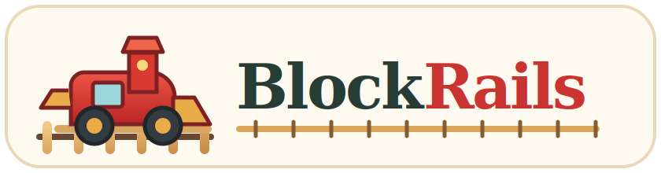
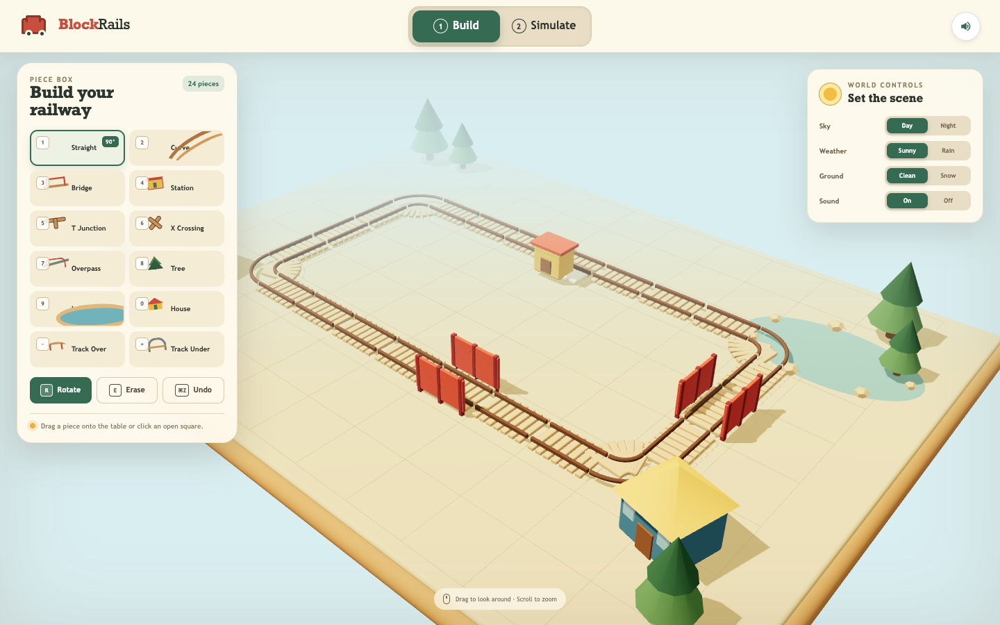

<p align="center">
  <a href="http://127.0.0.1:5173">
    
  </a>
</p>

# BlockRails

BlockRails is an interactive 3D wooden railway builder. Place track pieces on the play table, rotate or erase them, then switch to Simulate mode and send the train around the connected route.

## Application view

[](http://127.0.0.1:5173)

The rendered Build view shows the compact vertical building box on the left, the editable wooden railway and scenery in the center, and the day, weather, ground, and sound switches on the right. The Build and Simulate tabs at the top change between track editing and running the nine-wagon train. Click the image after starting the application to open BlockRails.

## Requirements

- Node.js 20 or newer
- npm 10 or newer

## Run

```bash
./start.sh
```

Open [http://127.0.0.1:5173](http://127.0.0.1:5173).

Stop the application with:

```bash
./stop.sh
```

## Controls

- Drag track or scenery blocks from the piece box onto an open grid square.
- Select a piece and click an open grid square for an alternate placement method.
- Use `1` through `9`, `0`, `-`, and `=` to select the build blocks.
- Hover or select a placed block and press `R` to rotate it.
- Hover or select a placed block and press `E` to erase it.
- Press `Cmd+Z` or `Ctrl+Z` to undo the last edit.
- Drag the play table to orbit the camera and scroll to zoom.
- Switch to Simulate and use Start train to run on the longest connected route.
- Connected T Junction and X Crossing blocks alternate between available routes during simulation.
- Adjacent Lake blocks merge into larger water shapes with rocks only around the outside shoreline.
- The locomotive pulls nine cargo and passenger wagons.
- Change the sky, weather, and ground with the world controls.
- Select Rain and Snow together to turn the precipitation into falling snowflakes.
- Use Sound On/Off or the speaker button for train chuffs, steam, rain, winter wind, woodland wind, birds, night insects, and station sounds.
- A Bridge and Lake can share one square so the railway crosses above the water.
- Track Over raises the route, connected pieces stay level above the table, and Track Under returns the route to ground level.
- Lakes can sit beneath raised track pieces.
- Steam rises and fades above the locomotive while it runs.

## Build blocks

- `1` Straight
- `2` Curve
- `3` Bridge
- `4` Station
- `5` T Junction
- `6` X Crossing
- `7` Overpass
- `8` Tree
- `9` Lake
- `0` House
- `-` Track Over
- `=` Track Under

## Test

```bash
./test.sh
```

The test creates the production build and checks its entry file.
