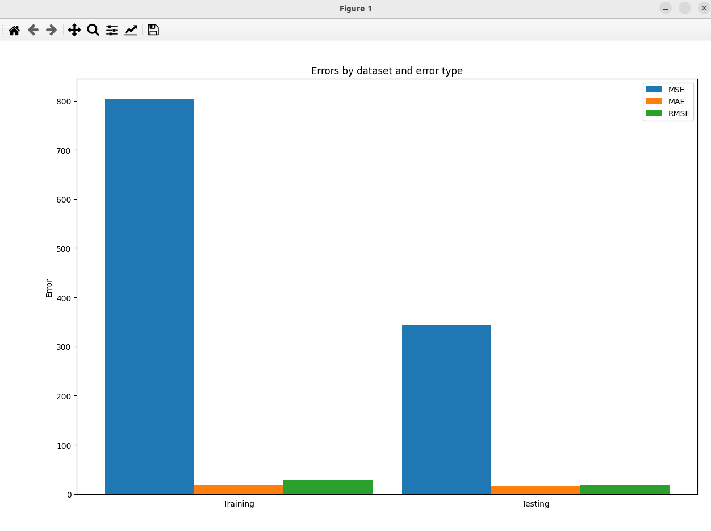

### Result
* Regression
* Program use 3 different error metrics
* MAE - Mean Absolute Error
* MSE - Mean Squared Error
* RMSE - Root Mean Squared Error
* MAE is the average of the absolute values of the errors
* MSE is the average of the squared errors
* RMSE is the square root of the average of the squared errors

