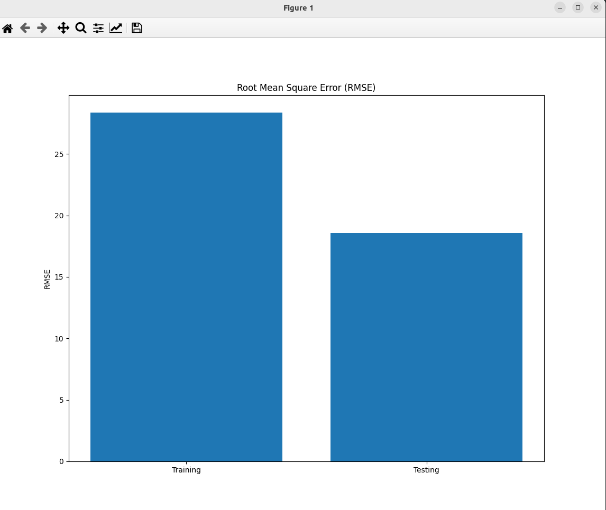

### Result
* Regression
* Ploting model performance
* RMSE means Root Mean Squared Error
* RMSE is a measure of how spread out these residuals are. In other words, it tells you how concentrated the data is around the line of best fit.

