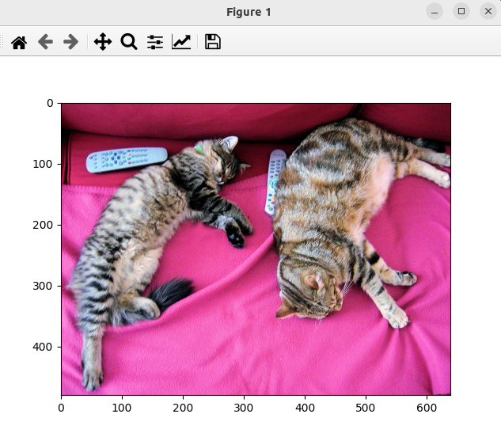

### Result
* Uses Transformers
* Uses ViT from Google
* Given a image it tells what is in the image

Input:


Output:
```
Warning: Ignoring XDG_SESSION_TYPE=wayland on Gnome. Use QT_QPA_PLATFORM=wayland to run on Wayland anyway.
preprocessor_config.json: 100%|████████████████████████████████████████████████████████████████████████████████████████████████████████████████████| 160/160 [00:00<00:00, 933kB/s]
config.json: 100%|████████████████████████████████████████████████████████████████████████████████████████████████████████████████████████████| 69.7k/69.7k [00:00<00:00, 4.12MB/s]
model.safetensors: 100%|████████████████████████████████████████████████████████████████████████████████████████████████████████████████████████| 346M/346M [00:08<00:00, 39.9MB/s]
Egyptian cat
```