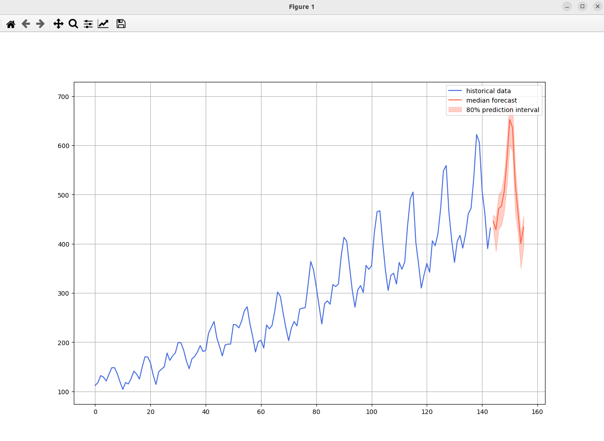

### Install amazon chronos (T5 model)

```
/bin/pip install git+https://github.com/amazon-science/chronos-forecasting.git
```

### Result
* Chronos: Chronos is a family of pretrained time series forecasting models based on language model architectures. 
* T5 model architecture: The only difference is in the vocabulary size: Chronos-T5 models use 4096 different tokens, compared to 32128 of the original T5 models.

