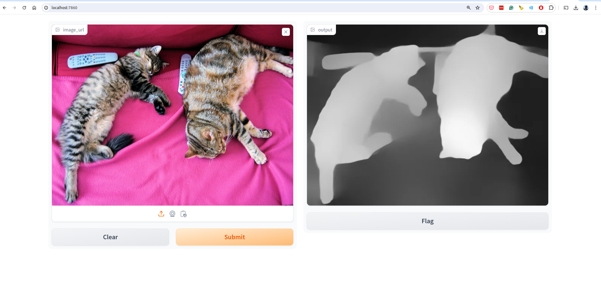
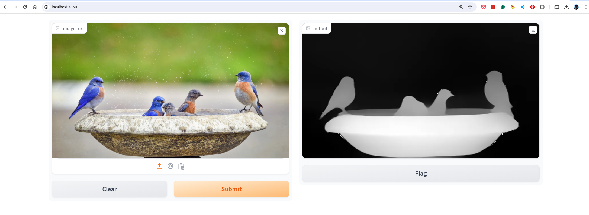
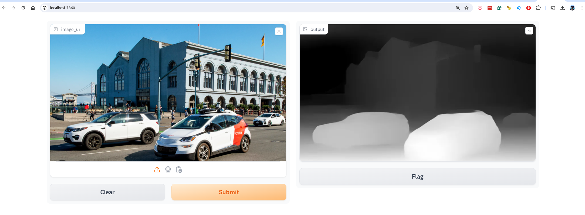

### Result
* Program does Depth Estimation
* Image depth estimation is about figuring out how far away objects in an image are. It's an important problem in computer vision because it helps with things like creating 3D models, augmented reality, and self-driving cars. In the past, people used techniques like stereo vision or special sensors to estimate depth.
* The LLM model used is Intel/dpt-large
* It uses gradio to create a web interface
* use: http://images.cocodataset.org/val2017/000000039769.jpg

Gradio UI:

Result:

