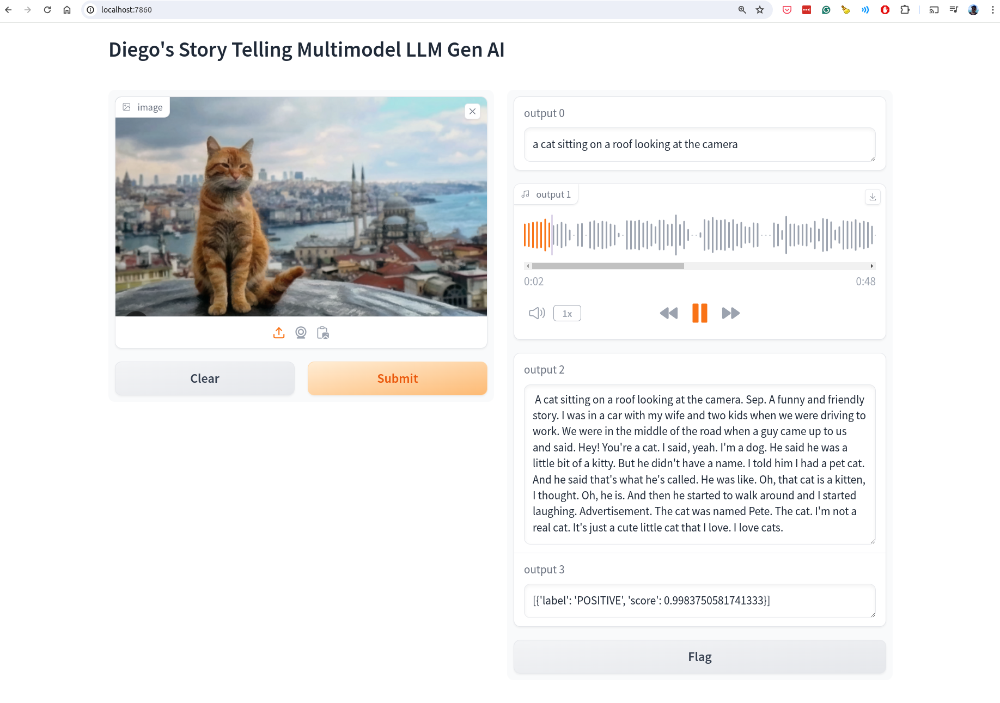

### Result
* Multi-models in action
* Story Telling
  * Given a image
  * Generate the caption for the image
  * Generate an background story for the text
* Use LLM models:
  * Salesforce/blip-image-captioning-base for image captioning
  * gpt2 for text generation
  * gTTS for text to speech, gTTS is a Python library and CLI tool to interface with Google Translate's text-to-speech API.
  * openai/whisper-large-v2 for speach recognition
  * pipeline/sentiment-analysis task for sentiment analysis of the text story

Result UI:

Audio Result:

<audio controls>
  <source src="audio.mp3" type="audio/mpeg">
</audio>