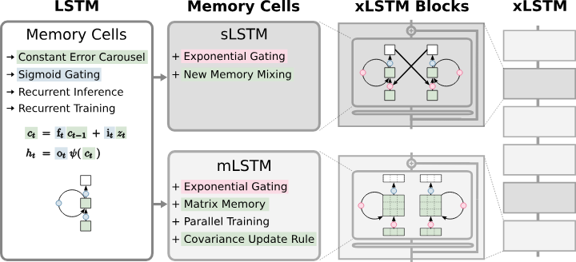

### Result
* xlstm
* xLSTM is a new Recurrent Neural Network architecture
* LSTM and shows promising performance on Language Modeling



```
x.shape: torch.Size([4, 256, 128])
y.shape: torch.Size([4, 256, 128])
```

