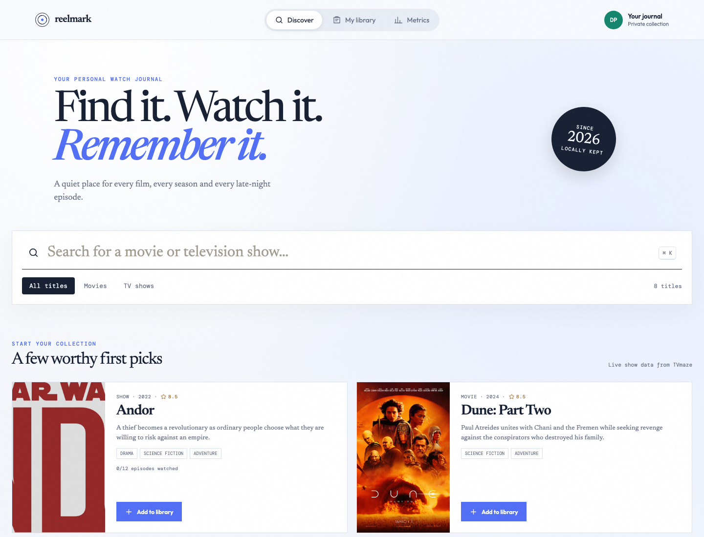
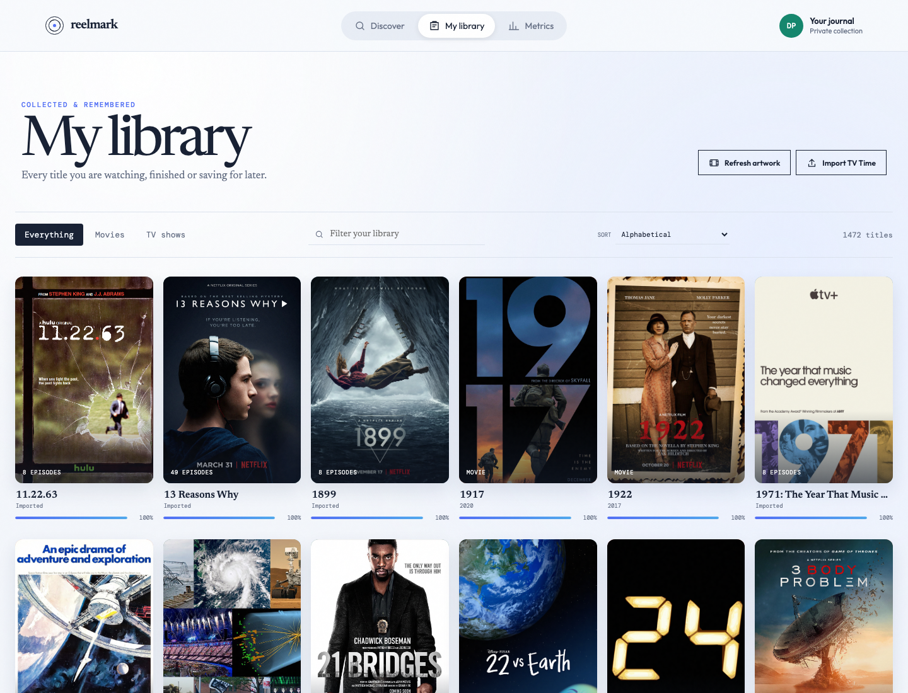
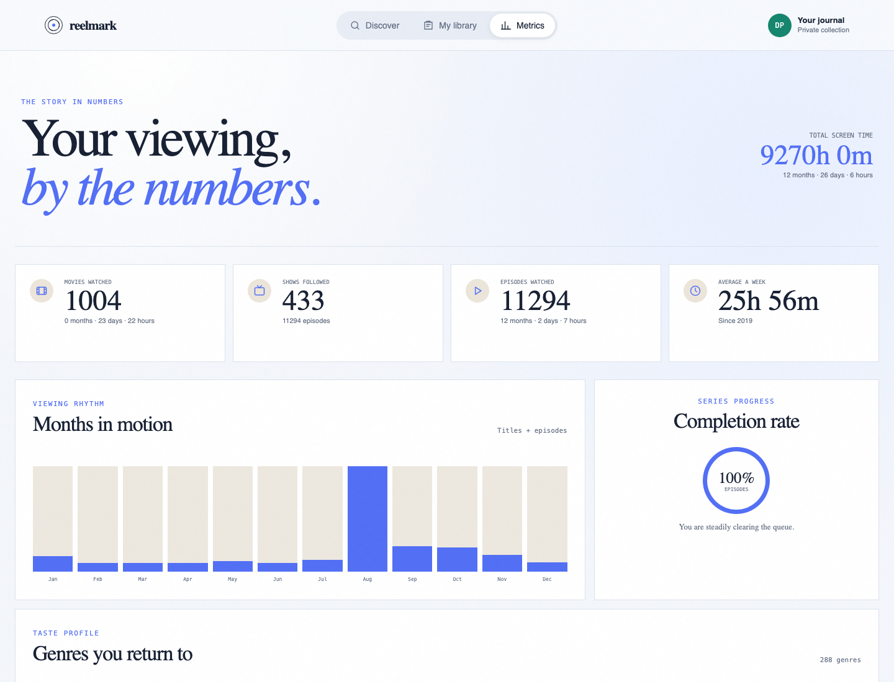

# Reelmark


Reelmark is a private watch journal for movies and television. It tracks films, seasons, episodes, time watched, completion, and genre patterns in a light editorial interface.

## Run

Requirements: Bun 1.3 or newer and at least one supported AI CLI for catalog research.

```bash
bun install
./start.sh
```

Open `http://127.0.0.1:5173`.

```bash
./test.sh
./stop.sh
```

## Data

SQLite data is stored at `data/reelmark.db` and can be versioned with the repository. The built-in catalog keeps the interface useful offline. [TVmaze](https://www.tvmaze.com/api) supplies keyless television search and episode data. [TMDB](https://developer.themoviedb.org/docs/getting-started) supplies wider movie search when `TMDB_ACCESS_TOKEN` is configured.

Copy `.env.template` to `.env` and load the variables before starting when TMDB access is wanted.

## TV Time import

TV Time is scheduled to close on July 15, 2026. Request the official GDPR archive at [gdpr.tvtime.com](https://gdpr.tvtime.com/gdpr/self-service) before that date. In My library, select Import TV Time and upload `tracking-prod-records-v2.csv` from the archive.

The importer matches shows and episodes against the local catalog and TVmaze. Unmatched rows are reported and can be retried later. Community posts and reactions are not part of the tracking import.

Refresh artwork sends media titles to Wikipedia and Wikidata, plus titles and release years to IMDb. Returned image paths and genre labels are stored in SQLite; account identifiers and watch status are never sent.

## AI catalog

Discover can ask an installed AI CLI to browse the web for current and older titles. Codex CLI is the saved default. Claude CLI and Gemini CLI can be selected in the interface. Results are cached in SQLite for six hours and retain direct source links.

The AI instruction lives in `prompts/catalog.md` and accepts the `{{topic}}` parameter. The backend invokes:

- `codex --search exec` with a read-only sandbox and structured output
- `claude -p` with web-only tools and structured output
- `gemini -p` in plan mode with JSON output

The CLIs use their existing local authentication. Research runs have a three-minute process limit and cannot modify project files.

## Interface

### Discover



Search the local catalog and live TVmaze data, filter by media type, and add a title to the library.

### Library



Open a show by season, mark individual episodes watched, import TV Time history, or complete a movie in one action.

### Metrics



Review movie, show, episode, runtime, completion, monthly activity, and genre totals calculated from SQLite.

## Stack

- TypeScript 6.0
- Bun backend and test runner
- SQLite through `bun:sqlite`
- React 19 and Vite 8
- TanStack Router, Query, and Table
