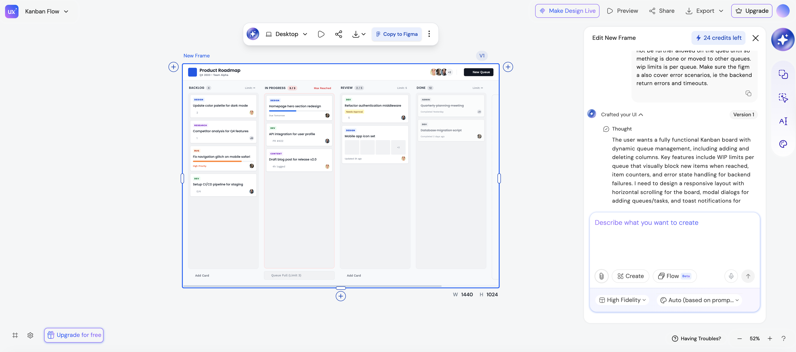

# UX Magic

https://uxmagic.ai/

## Prompt

```
generate a kanban board, where I can add as many queues as I want, also I should be able to delete queues, as we have work items on the queues, we must have counters per queue, and we should also have wip limits, and when wip limits are reach cards should not be further allowed on the queu until something is done or moved to other queues. wip limits is per queue. Make sure the figma also cover error scenarios, ie the backend return errors and timeouts.
```

## Result(Figma)



## Experience notes

* It works very well
* You get some free credits to try
* You can preview
* You can export to figma
* You can get the HTML/CSS files
* The UX looks nice and solid