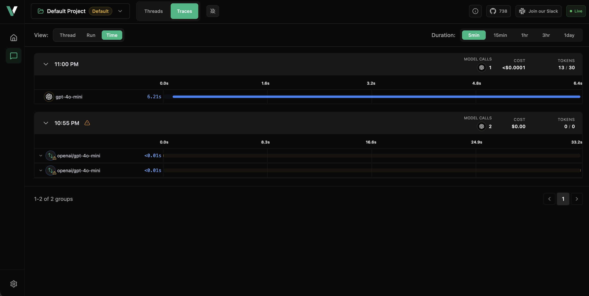

# VLLora

Trace, analyze, and optimize instantly. Seamless with LangChain, Google ADK, OpenAI, and all major frameworks.


## Install

```bash
brew tap vllora/vllora 
brew install vllora
```

## Run 

```bash
❯ vllora

        _     _
 __   _| |   | |    ___  _ __ __ _
 \ \ / / |   | |   / _ \| '__/ _` |
  \ V /| |___| |__| (_) | | | (_| |
   \_/ |_____|_____\___/|_|  \__,_|

2025-12-17T06:54:15.806488Z  INFO Running migrations
2025-12-17T06:54:15.806601Z  INFO Migrations complete
2025-12-17T06:54:15.806961Z  INFO No projects found in database. Creating default project...
2025-12-17T06:54:15.808103Z  INFO Created default project: Default Project (ID: def8b176-5c86-48b7-a930-05e2540392ef)
2025-12-17T06:54:15.808208Z  INFO Loading embedded models data...
2025-12-17T06:54:15.959268Z  INFO ✓ Successfully loaded 336 models from embedded data
2025-12-17T06:54:15.959379Z  INFO Syncing providers from API...
2025-12-17T06:54:15.959409Z  INFO Fetching providers from LangDB API...
2025-12-17T06:54:16.774571Z  INFO Successfully processed 17 providers (inserted 17 new ones)
2025-12-17T06:54:16.774668Z  INFO Successfully synced 17 providers
2025-12-17T06:54:16.774675Z  INFO ✓ Successfully synced providers to database

🌐 AI Gateway starting up:
   🚀 HTTP server ready at: http://0.0.0.0:9090

🌐 Starting UI server...
   🚀 UI server ready at: http://0.0.0.0:9091

🌐 Starting MCP server...
   🚀 MCP server ready at: http://0.0.0.0:9090/mcp

🌐 Starting OTEL gRPC collector...
   🚀 OTEL gRPC collector ready at: http://0.0.0.0:4317

📚 Where the cool kids hang out:
   🔍 Read the docs (if you're into that): https://vllora.dev/docs
   ⭐ Drop us a star: https://github.com/vllora/vllora
   🎮 Join our Slack (we have memes): https://join.slack.com/t/vllora/shared_invite/zt-2haf5kj6a-d7NX6TFJUPX45w~Ag4dzlg

⚡Quick Start ⚡
━━━━━━━━━━━━━━━━━━━━━━━━━━━━━━━━━━━━━━━━━━━━━━━━━━━━━━━━━━━━━━━

curl -X POST http://0.0.0.0:9090/v1/chat/completions \
  -H "Content-Type: application/json" \
  -d '{
    "model": "gpt-4o-mini",
    "messages": [{"role": "user", "content": "Hello vLLora!"}]
  }'

━━━━━━━━━━━━━━━━━━━━━━━━━━━━━━━━━━━━━━━━━━━━━━━━━━━━━━━━━━━━━━━

💫 Join the fun:
   🌟 Star the repo (we'll notice!)
   💬 Share your builds on Slack
   🔥 Keep up with our shenanigans on X

🚀 Opening UI in your default browser...
2025-12-17T06:57:32.838979Z  INFO POST /session/track HTTP/1.1 200 0ms
2025-12-17T06:57:32.867235Z  INFO GET /providers HTTP/1.1 200 1ms
2025-12-17T06:57:32.869014Z  INFO GET /projects HTTP/1.1 200 1ms
2025-12-17T06:57:32.882603Z  INFO GET /debug/breakpoints HTTP/1.1 200 0ms
2025-12-17T06:57:32.883309Z  INFO GET /providers HTTP/1.1 200 0ms
2025-12-17T06:57:32.902071Z  INFO GET /v1/pricing?include_parameters=true&include_benchmark=true HTTP/1.1 200 36ms
2025-12-17T06:57:32.927366Z  INFO GET /v1/pricing?include_parameters=true&include_benchmark=true HTTP/1.1 200 24ms
2025-12-17T06:57:32.979731Z  INFO GET /events HTTP/1.1 200 0ms
2025-12-17T06:57:33.011022Z  INFO GET /debug/breakpoints HTTP/1.1 200 0ms
2025-12-17T06:57:51.735759Z  INFO POST /threads HTTP/1.1 200 0ms
2025-12-17T06:57:51.736298Z  INFO GET /events HTTP/1.1 200 0ms
2025-12-17T06:58:11.275155Z  INFO GET /events HTTP/1.1 200 0ms
2025-12-17T06:58:11.277243Z  INFO GET /group?group_by=time&bucket_size=300&limit=20&offset=0 HTTP/1.1 200 0ms
```

## Trace it

After configuring the OpenAI API in VLLORA you run.

```bash
curl -X POST \
  'http://localhost:9090/v1/chat/completions' \
  -H 'x-project-id: def8b176-5c86-48b7-a930-05e2540392ef' \
  -H 'content-type: application/json' \
  -d '{
  "model": "openai/gpt-4o-mini",
  "messages": [
    {
      "role": "user",
      "content": "Hello, how are you?"
    }
  ],
  "stream": true
}'
```

### Results

