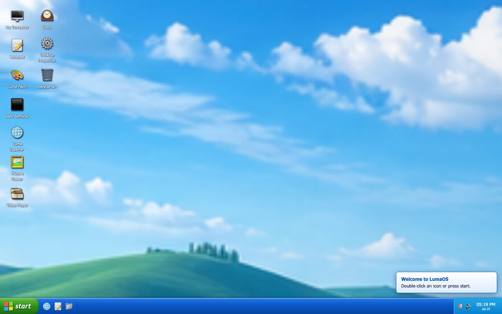
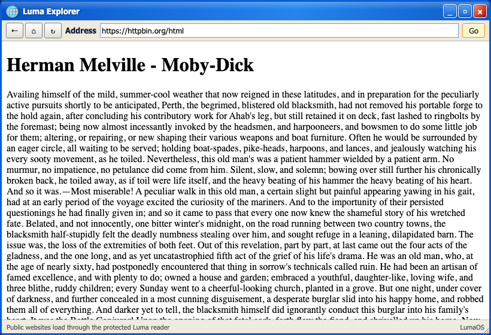

# LumaOS 2003

LumaOS is a self-contained browser desktop inspired by the tactile, colorful personal computers of the early 2000s. It uses plain HTML, CSS and JavaScript with no runtime libraries.

## Desktop



The desktop combines the default Emerald Hills wallpaper with app shortcuts, a Start button, quick-launch controls, task buttons and a live system tray. Double-clicking a shortcut opens its app in a draggable, resizable desktop window.

## Run

```bash
./start.sh
```

The script searches from port `4173`, prints the selected port and displays the full address.

Set a different starting port when needed:

```bash
WEBOS_PORT=8080 ./start.sh
```

Stop the exact tracked local server and its selected port:

```bash
./stop.sh
```

Run the local checks:

```bash
./test.sh
```

Run the Chromium interaction checks after installing development dependencies:

```bash
npm install
WEBOS_PORT=43174 ./start.sh
npx playwright test tests/webos.spec.js --browser chromium --workers 1
WEBOS_PORT=43174 ./stop.sh
```

## Included apps

- My Computer with persistent folders and text files
- Notepad with local saving and text download
- Luma Paint with pencil, brush, eraser, undo and PNG saving
- Safe Terminal with a small allowed command set
- Luma Explorer with an in-window protected web reader
- Picture Viewer with five bundled scenes
- Video Player with two local canvas animations
- Clock, Desktop Properties, Help and Recycle Bin

## Desktop controls

- Double-click an icon to open an app
- Drag title bars to move windows
- Use title bar controls to minimize, maximize or close
- Right-click the wallpaper for desktop actions
- Use Desktop Properties for five bundled wallpapers or a direct image link
- Open apps from the Start menu or taskbar

## Luma Explorer



Enter a web address or search term and press `Go`. Luma Explorer validates the destination and loads it through the local Luma reader inside the desktop window. Searches use DuckDuckGo's HTML results page.

The reader accepts only public HTTP and HTTPS destinations. Localhost, private networks, credentials and oversized responses are blocked. The loaded page stays inside a sandbox without same-origin access. DuckDuckGo may request a human verification step, which also appears inside Luma Explorer.

The back button moves through Luma Explorer history or returns home. Refresh reloads the current address.

## Storage and safety

Notes, folders and personalization settings use browser local storage. Clearing site data resets them.

Safe Terminal never runs system shell commands. It accepts only `help`, `pwd`, `ls`, `cd`, `mkdir`, `touch`, `cat`, `echo`, `date`, `whoami`, `hostname`, `history`, `clear` and `open`. Destructive command names and shell operators are rejected.

Luma Explorer uses a local reader because many websites prevent direct framed display. Static pages and DuckDuckGo HTML search results work best. Sites that require complex authentication, streaming, browser storage or advanced scripts may provide limited behavior.

The scripts bind the server to `127.0.0.1`, track one explicit process ID, wait in one-second checks and never scan or stop unrelated processes.
