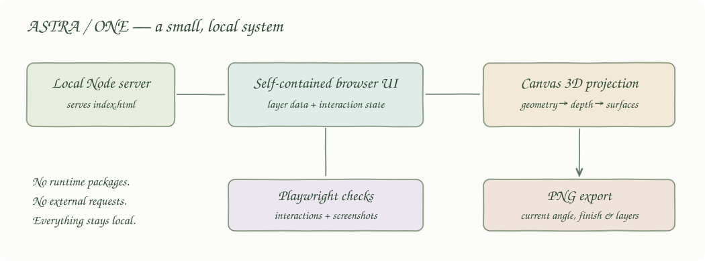
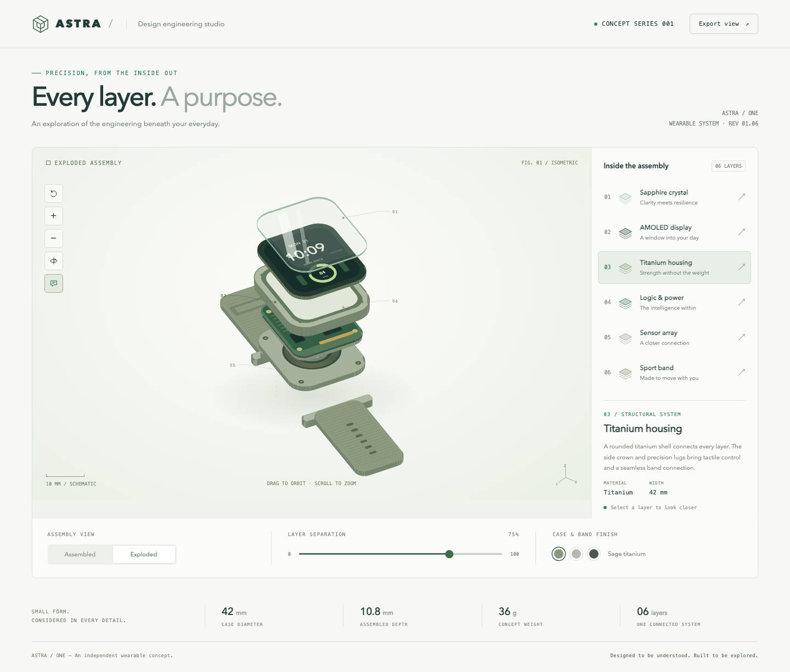
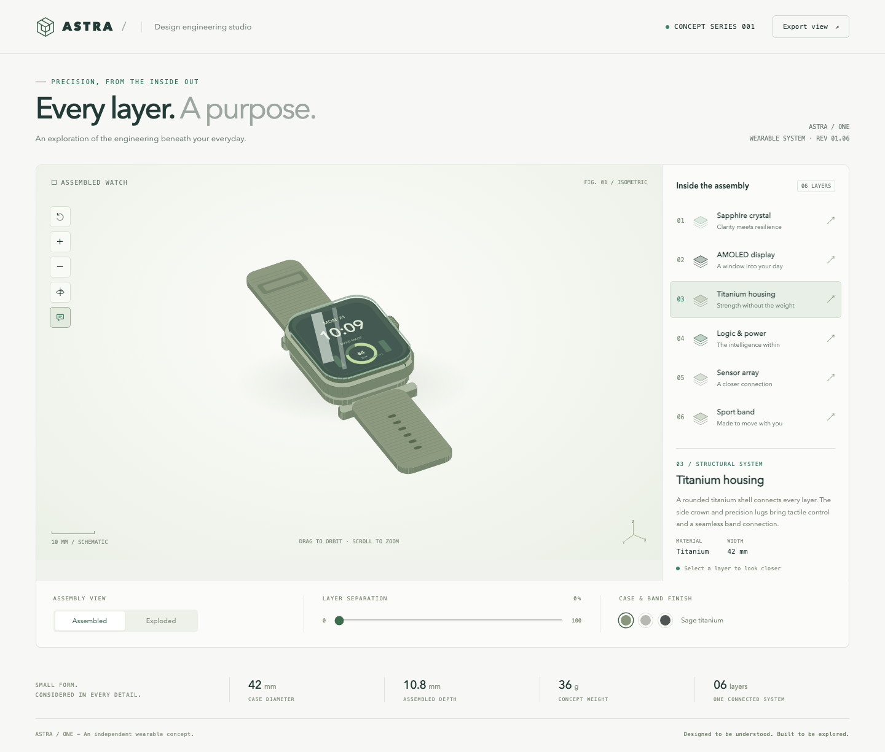
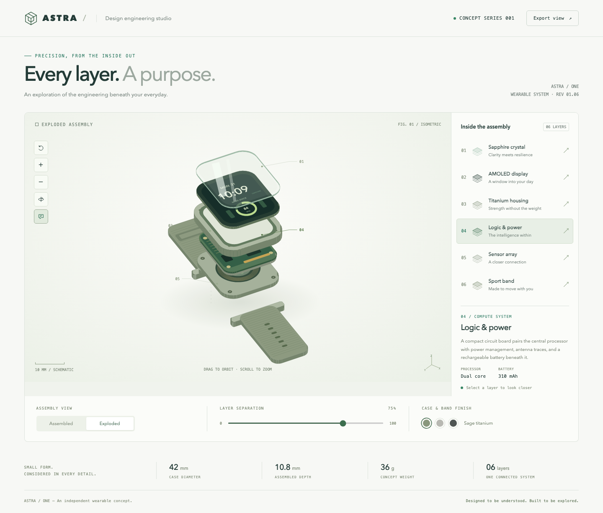
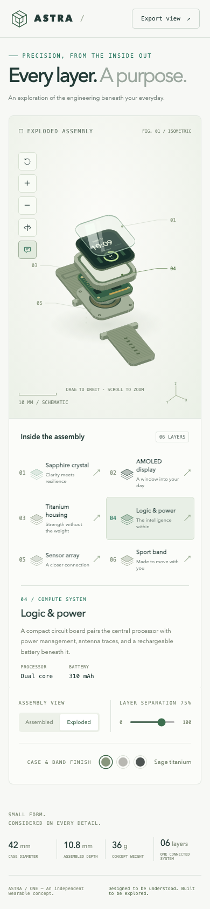

An interactive 3D wristband watch schematic with six explorable layers. A light, sage-toned engineering workspace lets you orbit the watch, assemble its components, inspect the internals, change finishes, and export the current view.

The watch is an original visual concept. Dimensions, materials, and component specifications are design targets, not validated hardware or manufacturing instructions.

## How it Works?

The browser creates rounded, extruded watch components from geometric points.
A small Canvas renderer rotates and projects those points, then paints surfaces in depth order.
The separation control changes each component's height to assemble or explode the watch.
Selecting a component updates its outline and the engineering detail panel.
The same renderer handles mouse, touch, keyboard, finish changes, and PNG exports.
Everything runs locally without runtime packages or external network requests.

## Architecture



The local Node server serves a single self-contained `index.html`. UI state and component data feed the Canvas renderer directly. Playwright checks the running UI and captures its views. The architecture artwork uses pastel boxes, solid arrows, a wobble filter, and the Caveat handwriting font with a cursive fallback.

## Features

- Six selectable layers: sapphire crystal, AMOLED display, titanium housing, logic and power, sensor array, and sport band.
- Continuous assembly separation with quick assembled and exploded views.
- Mouse and touch orbit, keyboard rotation, zoom, optional automatic rotation, and reset.
- Sage, natural, and graphite titanium finishes, with matching bands.
- Toggleable numbered annotations and component details.
- Local PNG export of the current angle, finish, and separation.
- Responsive desktop and mobile layouts with labeled controls and reduced-motion support.

## Stack

- HTML and CSS: the entire responsive light-themed interface lives in one file.
- Vanilla JavaScript and Canvas 2D: custom 3D projection avoids a graphics dependency.
- Node.js built-in HTTP and filesystem modules: a small local static server with an explicit asset allowlist.
- Playwright: the only development dependency, used for real Chromium interaction checks and screenshots.
- Bash: predictable setup, start, status, test, browser opening, and stop commands.

## Contracts/APIs

| Route | Result |
|---|---|
| `GET /` or `/index.html` | Self-contained application HTML |
| `GET /assets/{name}.svg` | Project artwork |
| `GET /printscreens/{name}.png` | Captured UI views |
| All other paths | HTTP 404 |

The server binds to `127.0.0.1`. There is no database, user account, remote API, or persistent application state. Reloading restores the initial view. Export creates `astra-one-schematic.png` directly in the browser.

## Key Data Structures and Design Decisions

`layers` holds six ordered component records, each with its name, description, material category, two specifications, and preview color. `palettes` maps finish names to case, band, and edge colors.

Viewer state contains the selected layer, camera yaw and pitch, zoom, current and target separation, rotation toggle, annotation toggle, and finish. Geometry is rebuilt from this state. Each polygon stores projected points, depth, component identity, and optional surface decoration. Hit testing selects the visible component under a click.

Orthographic projection provides a technical schematic appearance. Depth-sorted Canvas surfaces keep the application self-contained; this is a visual exploration tool rather than a CAD solid modeller. The band is displayed flat, and separation is exaggerated for readability. Animation runs only during transitions or when automatic rotation is enabled.

## Run the App and Tests

Requires Node.js 20 or newer, npm, Bash, curl, ripgrep, and lsof. Initial setup downloads Playwright and Chromium; viewing the application has no network dependency.

```bash
./scripts/setup.sh
./scripts/start-all.sh
./scripts/test-all.sh
./scripts/ui.sh
```

Open [ASTRA / ONE locally](http://127.0.0.1:4173). You can also open `index.html` directly in a browser without installing packages.

The browser suite verifies all six component selections; assembly, separation, and finishes; mouse and keyboard orbit; zoom, annotations, automatic rotation, and reset; PNG file output; desktop and mobile layout; and protection of operational files. Screenshots are refreshed by the suite.

## Printscreens

### Exploded assembly



The default view separates the crystal, display, housing, circuit board, sensor plate, and ribbed band. The right panel describes the selected titanium housing.

### Assembled watch



The assembled control brings the component stack together while retaining orbit, finish selection, and export controls.

### Logic and power



Selecting logic and power updates the detail panel and highlights its geometry. Visible traces, contacts, and processor markings expose the internal layout.

### Mobile



The viewer sits above a two-column component selector, with controls and specifications below. Touch dragging rotates the same 3D schematic.

## Scripts

All scripts live in `scripts/` and resolve the project root from their own location.

| Script | What it does |
|---|---|
| `./scripts/setup.sh` | Installs locked development dependencies and Chromium |
| `./scripts/start-all.sh` | Starts the local server and checks readiness |
| `./scripts/status.sh` | Prints the frontend port, UP or DOWN, and PID |
| `./scripts/test-all.sh` | Runs all Playwright browser checks |
| `./scripts/ui.sh` | Opens the running UI in the default browser |
| `./scripts/stop-all.sh` | Stops the server owned by this project |

The frontend port is declared once in `scripts/ports.env` as `FRONTEND=4173`. PID and log files live under ignored `.run/`. Scripts refuse to take over an occupied port and only stop this project's recorded server process. There is no SQL console because the application has no database.

```bash
./scripts/status.sh
./scripts/start-all.sh
./scripts/status.sh
./scripts/ui.sh
./scripts/stop-all.sh
./scripts/status.sh
```
